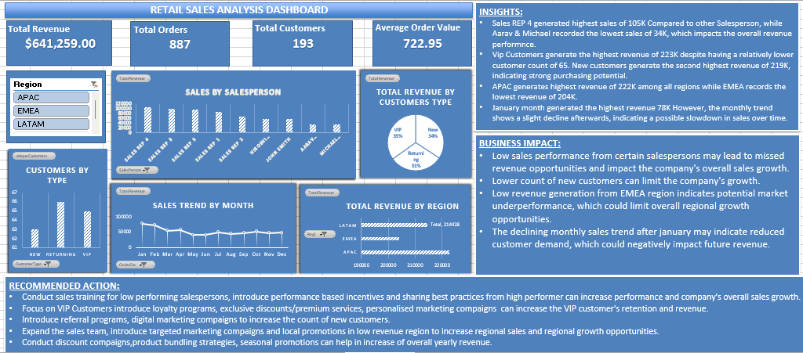

## Retail Sales Analysis Dashboard (Excel)

# Project Overview

This project analyzes retail sales data to identify key business insights related to revenue performance, customer behavior, regional sales distribution, and salesperson performance.
An interactive Excel dashboard was built to help stakeholders quickly monitor business performance and support data-driven decision making.

---

Dataset

The dataset contains retail transaction data including:

- Order details
- Customer information
- Salesperson performance
- Regional sales distribution
- Monthly sales data

The dataset was initially messy and required cleaning before analysis.

---

Project Workflow

1. Data Cleaning

Performed the following data preparation steps:

- Removed missing and inconsistent values
- Standardized customer type categories
- Handled "Unknown" customer entries
- Ensured proper data formatting for analysis

Cleaned data was stored in a separate worksheet for analysis.

---

2. Data Analysis

Pivot tables were used to analyze key business metrics:

- Total Revenue
- Total Orders
- Unique Customers
- Average Order Value
- Revenue by Region
- Sales by Salesperson
- Customer Segmentation
- Monthly Sales Trends

---

3. Dashboard Development

An interactive Excel dashboard was built using:

- Pivot Tables
- Pivot Charts
- Slicers
- KPI Cards
- Data visualization techniques

The dashboard allows users to filter data by region and analyze sales performance.

---

Key Insights

- Sales Rep 4 generated the highest revenue (~105K), while Aarav and Michael recorded the lowest sales (~34K).
- VIP customers generated the highest revenue (~223K) despite having a smaller customer base.
- New customers generated the second highest revenue (~219K), indicating strong purchasing potential.
- APAC region contributed the highest revenue (~222K), while EMEA recorded the lowest (~204K).
- January recorded the highest monthly sales (~78K), followed by a slight declining trend in subsequent months.

---

Business Impact

- Low sales performance from certain salespersons may reduce overall revenue growth.
- A lower number of new customers may limit long-term business expansion.
- Underperformance in the EMEA region may indicate untapped market opportunities.
- Declining monthly sales trends may impact future revenue if not addressed.

---

Recommended Actions

- Provide training and performance incentives for low-performing salespersons.
- Introduce loyalty programs and personalized offers for VIP customers.
- Increase new customer acquisition through digital marketing and referral programs.
- Implement targeted marketing campaigns in low-performing regions.
- Introduce seasonal promotions and product bundling strategies to improve monthly sales performance.

---

Tools Used

- Microsoft Excel
- Pivot Tables
- Pivot Charts
- Slicers
- Data Cleaning Techniques

---

Files in This Repository

- "Retail_Sales_Data_Messy.xlsx" – Raw dataset
- "Retail_Sales_Data_Analyzed.xlsx" – Data cleaning, pivot tables, and dashboard
- "sales_dashboard.png" – Final dashboard screenshot

---

Dashboard Preview

---

Author

Data Analytics Project built using Microsoft Excel to demonstrate data cleaning, analysis, and dashboard development skills.
